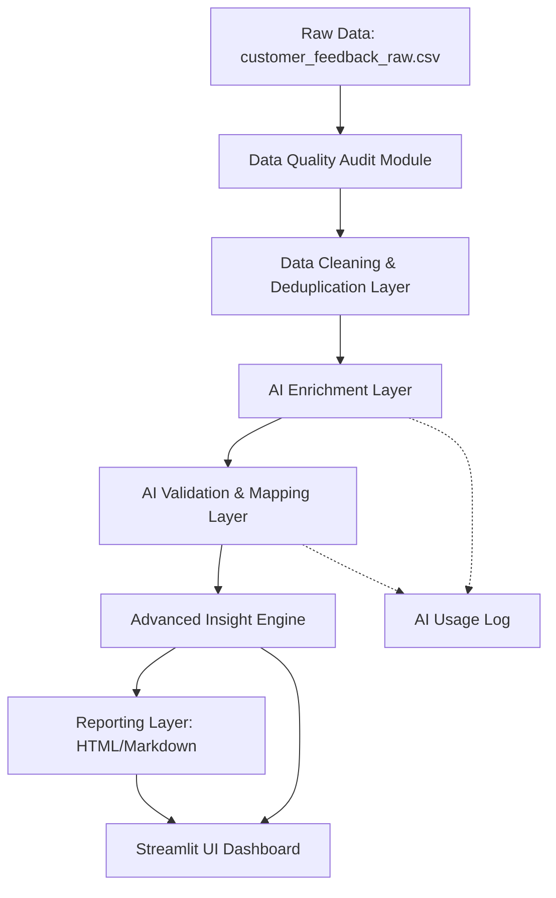

# QuickCart Customer Feedback Intelligence Pipeline

A production-grade, end-to-end data processing and business intelligence (BI) pipeline designed to ingest, clean, enrich, validate, and analyze customer feedback for the QuickCart food and grocery delivery platform.

This repository serves as a hiring assessment Proof of Concept (POC) demonstrating **data skepticism, AI output verification, logical engineering choices, and executive-ready business insights**.

---

## 🛠️ Setup & Running Instructions

### Prerequisites
- Windows OS (or macOS/Linux)
- Python 3.11+
- Pip package manager

### Installation
1. Clone the project or navigate to the workspace directory:
   ```bash
   cd c:\GitProjects\BI3-Assessment\
   ```
2. Install the package dependencies:
   ```bash
   C:\Users\Admin\AppData\Local\Programs\Python\Python311\Scripts\pip.exe install -r requirements.txt
   ```
3. Set up your environment variables:
   - Copy the [`.env.example`](file:///c:/GitProjects/BI3-Assessment/.env.example) template to create a new [`.env`](file:///c:/GitProjects/BI3-Assessment/.env) file:
     ```bash
     copy .env.example .env
     ```
   - Open [`.env`](file:///c:/GitProjects/BI3-Assessment/.env) and insert your API keys:
     ```env
     GROQ_API_KEY=your_groq_api_key_here
     GEMINI_API_KEY=your_gemini_api_key_here
     OPENAI_API_KEY=your_openai_api_key_here
     ```

### Running the Verification Script (Command-Line)
Execute the verification CLI script to run the pipeline end-to-end on the raw dataset and output the validated enriched feedback along with HTML/Markdown summaries directly to disk:
```bash
C:\Users\Admin\AppData\Local\Programs\Python\Python311\python.exe verify_pipeline.py
```

### Running the Dashboard (Streamlit Web Interface)
Start the Streamlit dashboard to interactively upload files, inspect data quality metrics, run the pipeline visualizer, view Plotly charts, edit low-confidence reviews, and download data exports:
```bash
C:\Users\Admin\AppData\Local\Programs\Python\Python311\Scripts\streamlit.exe run app.py
```

---

## 📐 Architecture & Modular Structure

The pipeline is built with a strict **Separation of Concerns (SoC)**, where each layer executes sequentially:



### Modular Components
- **[`src/config.py`](file:///c:/GitProjects/BI3-Assessment/src/config.py)**: Holds project configuration constants, allowed category/sentiment enums, fallback mappings, and keyword heuristics.
- **[`src/audit.py`](file:///c:/GitProjects/BI3-Assessment/src/audit.py)**: The raw data skepticism engine. Scans the raw input file for missing values, exact and text-based duplicates, unparseable dates, and potential contradictions before any cleaning occurs. Computes the **Dataset Health Score**.
- **[`src/cleaning.py`](file:///c:/GitProjects/BI3-Assessment/src/cleaning.py)**: Cleans the dataset by trimming whitespace, standardizing timestamps to ISO (`YYYY-MM-DD`), filtering out garbage placeholders (like `meh`, `...`), and performing **normalized exact match deduplication** to remove complaint inflation.
- **[`src/llm.py`](file:///c:/GitProjects/BI3-Assessment/src/llm.py)**: Handles AI calls. Interfaces dynamically with **Groq Llama 3**, **Google Gemini API** (using `gemini-2.0-flash`), or **OpenAI API** (using `gpt-3.5-turbo`), falling back to an offline classification engine if external AI services are unavailable. Loads credentials from the environment via `python-dotenv`.
- **[`src/enrichment.py`](file:///c:/GitProjects/BI3-Assessment/src/enrichment.py)**: Manages the batch row loop requesting sentiment, category, a business-friendly summary, and an AI confidence score.
- **[`src/validation.py`](file:///c:/GitProjects/BI3-Assessment/src/validation.py)**: The AI verification gate. Asserts that classification outputs match enums, corrects invalid categories, flags low confidence records (`< 0.70`) for manual human review, and logs actions in `ai_usage_log.json`. Computes the **Insight Reliability** level.
- **[`src/insights.py`](file:///c:/GitProjects/BI3-Assessment/src/insights.py)**: Computes distributions, weekly trends, rating-vs-sentiment conflicts, and dynamically yields prioritized business recommendations.
- **[`src/report_generator.py`](file:///c:/GitProjects/BI3-Assessment/src/report_generator.py)**: Automatically writes executive Markdown (`summary_report.md`) and HTML (`summary_report.html`) documents.

---

## 📊 Core Concepts & Formulas

### 1. Dataset Health Score
Traditional dashboards report raw errors (e.g. "Missing timestamps: 223"). We introduce a **Dataset Health Score (0–100%)** that translates data quality into a single executive KPI. Starting at 100, we apply deductive penalties weighted by anomaly impact:
$$\text{Health Score} = 100 - \sum \left( \frac{\text{Anomaly Count}}{\text{Total Records}} \times 100 \times \text{Weight} \right)$$
*Weight Constants:*
- Empty/Meaningless Feedback: `-1.5`
- Missing Timestamps, Invalid Timestamps, Duplicate Feedback: `-1.0`
- Missing Ratings, Duplicate Rows: `-0.5`

### 2. AI Confidence Score & Human-in-the-Loop Validation
AI classification is non-deterministic. For each row, the AI output includes a confidence value between `0.0` and `1.0`. The validation layer flags any records with confidence `< 0.70` as "Needs Human Review" and separates them into a dedicated review table.

### 3. Insight Reliability Index
Management needs to know how much they should trust recommendations. We calculate a consulting-style **Insight Reliability Index**:
- **High**: Dataset Health $\ge 80\%$ and Average AI Confidence $\ge 0.85$.
- **Limited by Source Data Quality**: Dataset Health $< 60\%$ or Average AI Confidence $< 0.70$.
- **Medium**: Any other combination.

*Presentation Context:* If reliability is flagged as *Limited by Source Data Quality*, it signals that the pipeline's verification layers worked correctly, but findings are constrained by raw quality issues (e.g. duplicate complaints, missing ratings, and incomplete dates). Insights should therefore be interpreted with appropriate caution.

---

## ⚙️ Design Decisions & Tradeoffs

### 1. Normalized Deduplication vs. Fuzzy Embedding Clusters
- **Decision:** Deduplicate based on exact matching of *normalized* text (stripping order numbers, agent names, city suffix templates, and repeating exclamation marks).
- **Tradeoff:** This method avoids complex vector database integrations or fuzzy distance parameter-tuning, while successfully collapsing the redundant tickets that cause complaint inflation (e.g. 5 tickets with the exact same complaint but different order IDs).

### 2. Fault Tolerance & Fallback Engine
- **Decision:** The enrichment layer supports multiple AI backends and automatically falls back to an offline classification engine if external AI services are unavailable. This ensures the pipeline executes successfully under all conditions.

### 3. HTML/Markdown vs. PDF Generating Libraries
- **Decision:** Output HTML and Markdown files instead of PDF documents.
- **Tradeoff:** Bypasses formatting, font registry, and platform-specific styling errors common to libraries like ReportLab or FPDF, allowing seamless styled viewing in browsers and easy integration with Streamlit.

### 4. Simplified, High-Value Data Exports
- **Decision:** We removed intermediate, duplicate csv file outputs and focused the dashboard exclusively on downloading the final, complete dataset (`enriched_feedback.csv`) alongside the executive report. This reduces disk clutter and guides users directly to the high-value enriched data product.

---

## 🚀 Future Improvements
- **True Multi-Label Categorization:** Some comments contain multiple issues (e.g. "driver was late AND coupon didn't work"). A multi-label model could tag both `Delivery` and `Billing` categories.
- **Automated Feedback Loop:** Send human-reviewed/corrected classifications back to the database as fine-tuning inputs for the next LLM cycle.
- **Advanced Sarcasm Classifier:** Use small local transformers (e.g., DeBERTa) to detect linguistic sarcasm in sentiment-rating contradictions.

---

## 💡 Presentation & Defense Strategy (MD Interview Q&A)

*For a detailed slide-by-slide 5-minute presentation script and 10 quick-fire question defenses, refer to the full [PRESENTATION_GUIDE.md](file:///c:/GitProjects/BI3-Assessment/PRESENTATION_GUIDE.md) document.*

### Core Philosophy
> [!IMPORTANT]
> **"I intentionally treated the dataset as untrusted. Before applying AI, I measured data quality, quantified complaint inflation, validated AI outputs, and only then generated business insights."**

Prepare to defend these key design decisions during the presentation:

### Question 1: Why did you create a Dataset Health Score?
* **Answer:** Raw counts are difficult for management to interpret quickly. The Dataset Health Score converts multiple data quality issues into a single KPI that communicates overall dataset trustworthiness.

### Question 2: Why did you add AI validation?
* **Answer:** AI outputs are probabilistic and can generate invalid categories. I introduced a validation layer to ensure all classifications conform to business rules before being used in analytics.

### Question 3: Why not directly trust the rating?
* **Answer:** Ratings and text sometimes contradicted each other. I found examples where users gave 5-star ratings but wrote negative feedback. Therefore, sentiment was primarily derived from the text and then compared against ratings to identify inconsistencies.

### Question 4: Why Streamlit?
* **Answer:** Since this was a proof-of-concept with limited time, I prioritized delivering a complete and reliable end-to-end solution. Streamlit enabled rapid visualization while allowing me to focus on data quality, AI verification, and business insights.

### Question 5: What is your biggest contribution beyond the requirements?
* **Answer:** Beyond the required enrichment pipeline, I introduced a Dataset Health Score, AI validation layer, confidence tracking, contradiction analysis, and automated business recommendations. These help decision-makers understand not only what customers are saying, but also how much confidence they should place in the resulting insights.
